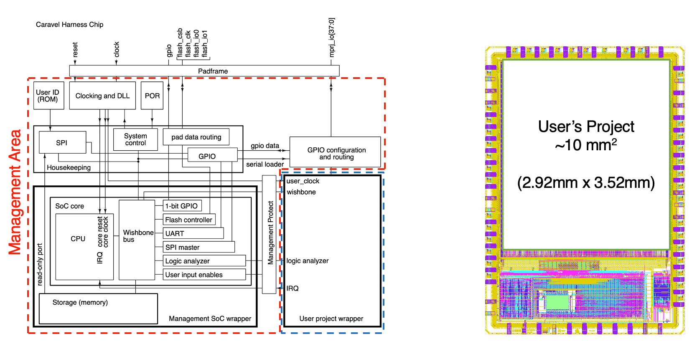
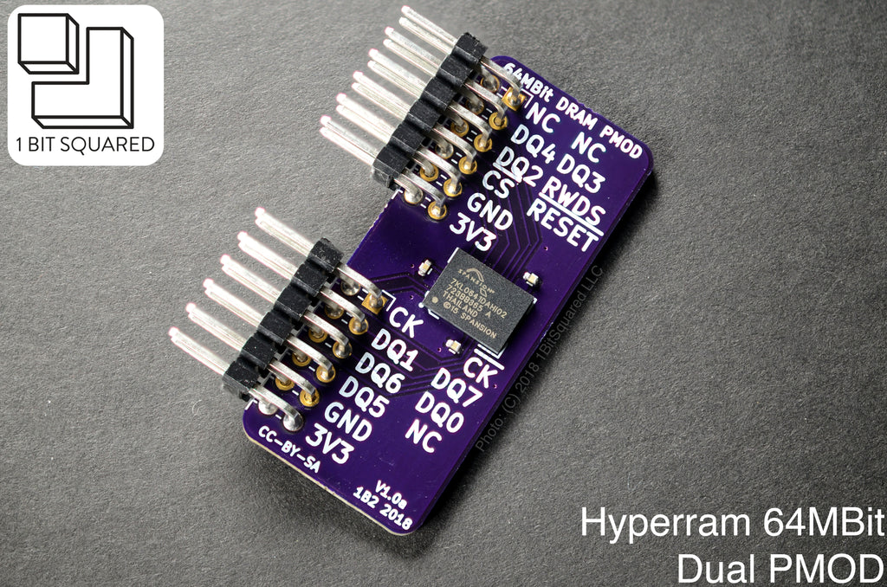

       ____     _____    __  _______  ________                         
      / __/__  / ___/  _/_/ / __/ _ \/ ___/ _ |                        
     _\ \/ _ \/ /__  _/_/  / _// ___/ (_ / __ |                        
    /___/\___/\___/ /_/   /_/ /_/ __\___/_/ |_|   

      / _ \___ ___ ___  __ _____________ ___
     / , _/ -_|_-</ _ \/ // / __/ __/ -_|_-<
    /_/|_|\__/___/\___/\_,_/_/  \__/\__/___/

**A collection of SoC/FPGA design and prototyping related resources**

    

# SoC Platform
* efabless ([link](https://efabless.com/ "efabless link"))   
Free silicon for open-source projects sponsored by Google   
  * caravel: SoC plaform by efables ([github link](https://github.com/efabless/caravel))   

 

* Chipyard   
https://github.com/ucb-bar/chipyard

 

* Pulp-platform   
https://github.com/pulp-platform/pulp

    

# RISC-V CPU
## Great archives   
* https://github.com/riscvarchive/riscv-cores-list   
* https://github.com/troyguo/awesome-dv/blob/master/README.md   

 

## Repos that caught my eye are below   

* xilinx-risc-v: PicoRV32 on Xilinx FPGA using Vivado flow   
https://github.com/irmo-de/xilinx-risc-v   
for picorv32 refer to...
https://github.com/YosysHQ/picorv32

 

* VexRiscv: a RISC-V implementation written in SpinalHDL   
Multiple core sizes are available + Example SoC
https://github.com/SpinalHDL/VexRiscv   
[(example of running linux on this cpu)](https://github.com/litex-hub/linux-on-litex-vexriscv)

 

* CVA6 RISC-V CPU: A 6-stage, single issue, in-order CPU which implements the 64-bit RISC-V instruction set.    
Fully supports a Unix-like operating system.   
https://github.com/openhwgroup/cva6

  

* PiFive CPU & SoC Generator: 32-bit RISC-V microcontroller designed in SystemVerilog    
The SoC includes HyperRAM!   
https://github.com/asinghani/pifive-cpu
  

# External Memory (Volatile)
## DDR
 

## HyperRAM
 

* Simulation Model   
Infineon (Cypress) provides system verilog files for behavior simulation

* IPs   
  * https://github.com/blackmesalabs/hyperram   

  

* PMOD Breakout Board ([Product link](https://1bitsquared.com/products/pmod-hyperram)) ([Github link](https://github.com/icebreaker-fpga/icebreaker-pmod/tree/master/quadhyperram))   
Dual PMOD HyperRAM breakout board, available in 8MB and 32MB (8bit wide)      
    
As in 2022-Nov-23, this seems like the only pmod compatible HyperRAM breakout board

 

## QDR SRAM

# External Memory (Non-volatile)
## HyperFlash
 

# Misc. IPs
* Tons of AXI IPs (Foundation, DMA, Ethernet, etc.) (+ Wishbone, DSP, LFSR)   
https://github.com/alexforencich   
http://www.alexforencich.com/wiki/en/start

 

## Foundation IPs
* Synthesizable AXI4, AXI4-Lite Foundation IPs (SystemVerilog)   
https://github.com/pulp-platform/axi

 

## Stuff
* The PoC-Library: implementations for often required hardware functions   
https://github.com/VLSI-EDA/PoC

* Collection of {AXI, Wishbone, etc.}  <-> {FTDI, USB, etc.} IPs   
https://github.com/ultraembedded/cores

   

# PDKs
* GlobalFoundries GF180MCU Open Source PDK   
https://github.com/google/gf180mcu-pdk

* SkyWater130 Open Source PDK   
https://github.com/google/skywater-pdk

   

# Utilities

* BML USB 3.0 FPGA INTERFACE OVER PMOD   
https://blackmesalabs.wordpress.com/2017/12/19/bml-usb-3-0-fpga-interface-over-pmod/

* FuseSoC: Package manager and a set of build tools for HDL code.   
https://github.com/olofk/fusesoc

   

## etc.
* CMake, SystemVerilog and SystemC utilities for creating, building and testing RTL projects for FPGAs and ASICs.   
https://github.com/tymonx/logic

* Berkeley Architecture Research   
https://bar.eecs.berkeley.edu/projects.html

# HW platforms   
	Genesys 2 - 200만원
		kintex7 325T
		HS-pmod 2개 
	
	arty a7 35 - 30만원
		artix7 35t 
	
	nexsys a7
		artix 50t - 50만원
	
	
	
	FPGA 	logic cells     lut
	7a35t	33.3k		    20,800
	7a100t	101.4k	 	    63,400
	7k325t	326k		    203,600
	z7020 	84k			    53,200
