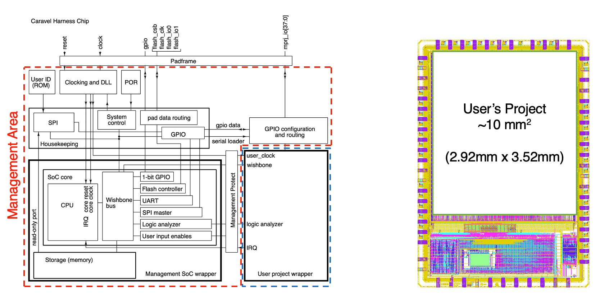
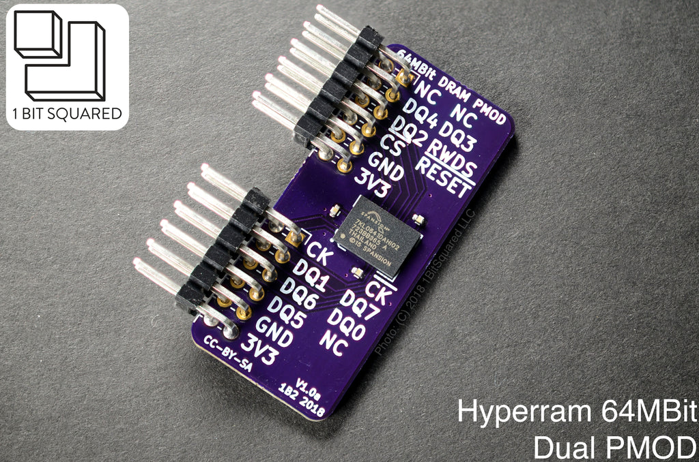

    ___       ___   ___         _             ___                                
    / __| ___ / __| |   \ ___ __(_)__ _ _ _   | _ \___ ___ ___ _  _ _ _ __ ___ ___
    \__ \/ _ \ (__  | |) / -_|_-< / _` | ' \  |   / -_|_-</ _ \ || | '_/ _/ -_|_-<
    |___/\___/\___| |___/\___/__/_\__, |_||_| |_|_\___/__/\___/\_,_|_| \__\___/__/
                                |___/                                           

**A collection of soc/fpga design and prototyping related resources**

    

# SoC Platform
## efabless ([link](https://efabless.com/ "efabless link"))
Free silicon for open-source projects sponsored by Google   

**caravel**: SoC plaform by efables ([github link](https://github.com/efabless/caravel))   

 

## Chipyard
https://github.com/ucb-bar/chipyard

 

## More platforms in this great archive  
https://github.com/riscvarchive/riscv-cores-list 

    

# CPU
## RISC-V
Great archive  
https://github.com/riscvarchive/riscv-cores-list   

# External Memory (Volatile)
## DDR
 

## HyperRAM
 

### IPs
https://github.com/blackmesalabs/hyperram   

  

### PMOD Breakout Board ([Product link](https://1bitsquared.com/products/pmod-hyperram)) ([Github link](https://github.com/icebreaker-fpga/icebreaker-pmod/tree/master/quadhyperram))
Dual PMOD HyperRAM breakout board, available in 8MB and 32MB (8bit wide)      

    

As in 2022-Nov-23, this seems like the only pmod compatible HyperRAM breakout board

 

## QDR SRAM

# External Memory (Non-volatile)
## HyperFlash
 

# Misc. IPs
## Foundation IPs
### Synthesizable AXI4, AXI4-Lite Foundation IPs (SystemVerilog)   
https://github.com/pulp-platform/axi

 

## Stuff
### The PoC-Library: implementations for often required hardware functions
https://github.com/VLSI-EDA/PoC

### Collection of {AXI, Wishbone, etc.}  <-> {FTDI, USB, etc.} IPs   
https://github.com/ultraembedded/cores

   

# PDKs
### GlobalFoundries GF180MCU Open Source PDK
https://github.com/google/gf180mcu-pdk

### SkyWater130 Open Source PDK 
https://github.com/google/skywater-pdk

   

# Utilities

### BML USB 3.0 FPGA INTERFACE OVER PMOD
https://blackmesalabs.wordpress.com/2017/12/19/bml-usb-3-0-fpga-interface-over-pmod/

   

## etc.
### Logic
CMake, SystemVerilog and SystemC utilities for creating, building and testing RTL projects for FPGAs and ASICs.
https://github.com/tymonx/logic

### Berkeley Architecture Research
https://bar.eecs.berkeley.edu/projects.html

# HW platforms   
	Genesys 2 - 200만원
		kintex7 325T
		HS-pmod 2개 
	
	arty a7 35 - 30만원
		artix7 35t 
	
	nexsys a7
		artix 50t - 50만원
	
	
	
	FPGA 	logic cells     lut
	7a35t	33.3k		    20,800
	7a100t	101.4k	 	    63,400
	7k325t	326k		    203,600
	z7020 	84k			    53,200